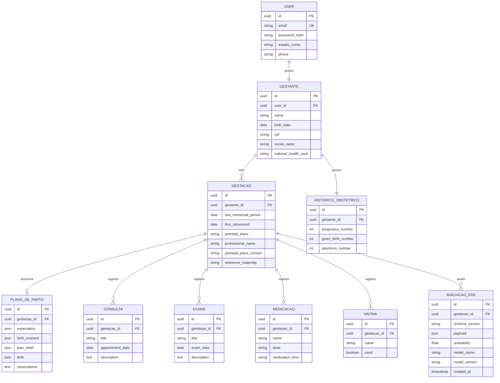

# Relatório FASE 6A — Auditoria do Pré-Natal, Fluxo de Acesso/Cadastro e Modelagem Inicial do Domínio do Backend

> Fase majoritariamente de **auditoria, mapeamento, documentação e modelagem
> conceitual** (somente leitura). **NÃO** foram implementados: autenticação real,
> cadastro real, banco de dados do servidor, ORM, migrations, endpoints CRUD do
> pré-natal, persistência do DSS, nem integração Flutter → API do pré-natal.
>
> A única alteração planejada no projeto nesta fase é o **`README.md` da raiz**
> (documentação de como iniciar a API e executar o Flutter), além deste relatório
> `FASE_6A_REPORT.md`. Nenhum arquivo de `lib/`, `api/`, `ia/` ou `test/` foi
> modificado. **NÃO foi feito commit.**

**Classificação final: FASE 6A CONCLUÍDA. PARE E AGUARDE REVISÃO.**

> Esta é a **última auditoria aprofundada** do módulo de gerenciamento do
> pré-natal antes do congelamento da FASE 6A. Ela consolida: (i) a **auditoria
> factual** do código (parte aprovada); (ii) o **inventário** completo de modelos
> e tabelas; e (iii) a **modelagem conceitual do domínio futuro** (revisada para
> eliminar inconsistências de ownership, entidades e contratos).

---

## A. Escopo e pré-condições

| # | Item | Situação |
|---|------|----------|
| 1 | Baseline: `git status --short` limpo ao iniciar | ✅ |
| 2 | Baseline: `flutter analyze` sem issues | ✅ (`No issues found!`) |
| 3 | Baseline: `flutter test` | ✅ (`All tests passed!` — 183/183) |
| 4 | Somente leitura de `lib/`, `api/`, `ia/`, `test/` | ✅ |
| 5 | Nenhuma implementação de auth/cadastro/ORM/migrations/endpoints CRUD | ✅ |
| 6 | Única alteração de projeto: `README.md` (raiz) + este relatório | ✅ |

> Os nomes de diretório reais são **pluralizados** (`repositories/`, `services/`)
> — diferentes dos nomes singulares (`repository/`, `service/`) eventualmente
> citados na especificação. Toda a auditoria usou os caminhos reais.

---

## B. Auditoria do módulo de gestão do pré-natal (`lib/app/modules/main/`)

O `MainModule` expõe uma página com **4 abas** (NavigationBar) via `TabBarView`.
O `MainController` guarda o índice da aba ativa, o `name` (lido de
`gestationRepository.getPregnant()?.name ?? 'Sem Nome'`) e o `titulo` da aba.

```
lib/app/modules/main/
├── main_module.dart          # DI: 13 repositories + 9 controllers (singletons)
├── main_controller.dart      # aba selecionada + nome da gestante (getPregnant)
├── main_page.dart            # Scaffold + TabBarView(4) + NavigationBar
├── widgets/
│   ├── base_card.dart
│   ├── tile_button.dart
│   └── home_card.dart
└── pages/
    ├── home/                 # ABA 1 — Home
    │   ├── home_page.dart / home_controller.dart (home_controller = stub "test")
    │   └── submodules/
    │       ├── information/       (informações educativas — 100% estático)
    │       ├── medication/        (medicamentos — CRUD local)
    │       ├── vaccines/          (vacinas — pré-cadastradas + toggle "used")
    │       └── appointments_exams/(consultas + exames — CRUD local)
    ├── gestation/            # ABA 2 — Gestação
    │   ├── gestation_page.dart / gestation_controller.dart
    │   └── submodules/
    │       ├── pregnant/          (identificação da gestante)
    │       ├── maternity/         (maternidade de referência = prenatalPlace)
    │       ├── pregnancy_history/ (histórico obstétrico)
    │       ├── baby_data/         (MISLABEL: exibe "nascimento" mas usa Exame)
    │       └── prenatal_appointment/ (consultas de pré-natal)
    ├── childbirth/           # ABA 3 — Parto (Plano de Parto)
    │   ├── childbirth_page.dart / childbirth_controller.dart (controller VAZIO)
    │   └── submodules/
    │       ├── identification/    (identificação da gestante)
    │       ├── history/           (histórico de gestações)
    │       ├── current_gestation/ (gestação atual — DUM / 1ª USG)
    │       ├── expectations/      (expectativas — 7 preferências)
    │       ├── birth_moment/      (momento do parto)
    │       ├── pain_relief/       (alívio da dor)
    │       ├── birth_expectations/(nascimento — 6 campos)
    │       ├── desires_expectations/ (observações / desejos)
    │       └── childbirth_resume/ (resumo do plano de parto)
    └── profile/              # ABA 4 — Perfil
        ├── profile_page.dart
        └── submodules/
            ├── profile_data/      (Meus Dados — edita pregnant + user)
            ├── notificacoes/      (estático — 3 itens hardcoded)
            ├── configuracoes/     (estado local somente, sem persistência)
            └── sobre_app/         (estático)
```

> **Contagem de DI:** `MainModule.binds` registra **13 repositories** e
> **9 controllers** (`GestationController`, `ChildbirthResumeController`,
> `VaccinesController`, `MedicationController`, `ProfileDataController`,
> `ExpectationsController`, `HistoryController`, `IdentificationController`,
> `MainController`). Os controllers específicos de cada subseção (ex.:
> `CurrentGestationController`, `BirthController`, `PainReliefController`,
> `ObservationsController`, `AppointmentsExamsController`, `HomeController`,
> `ChildbirthController`) são resolvidos via `Modular.get<>()` a partir dos
> `bind` de seus **próprios sub-módulos** (`*_module.dart`), não centralmente.

**Funcionalidades de gestão do pré-natal identificadas:**

| Funcionalidade | Tabela local | Repositório | UI |
|----------------|--------------|-------------|----|
| Identificação da gestante (dados pessoais, CPF, Cartão SUS) | `pregnant` | `GestationRepository` | `identification` / `pregnant` / `profile_data` |
| Local do pré-natal / profissional | `pregnant` | `GestationRepository` | `maternity` |
| Gestação atual (DUM, 1ª USG) | `current_pregnancy` | `CurrentGestationRepository` | `current_gestation` |
| Histórico obstétrico (nº gravidezes/partos/abortos) | `previous_pregnancy` | `HistoryRepository` | `history` / `pregnancy_history` |
| Consultas | `appointment` | `AppointmentsRepository` | `appointments_exams` / `prenatal_appointment` |
| Exames | `exam` | `ExamsRepository` | `appointments_exams` / `baby_data` |
| Medicamentos | `medication` | `MedicationRepository` | `medication` |
| Vacinas | `vaccine` | `VaccinesRepository` | `vaccines` |
| Plano de parto (momento, nascimento, dor, expectativas, observações) | `birth_moment`, `birth`, `pain_relief`, `expectation`, `observations` | respectivos | `childbirth/*` |
| Resumo do plano de parto | (agrega 8 tabelas) | `ChildbirthResumeController` | `childbirth_resume` |

---

## C. Auditoria do banco local — tecnologia

**Tecnologia: `sqflite`** (SQLite nativo), **sem** Drift e **sem** codegen. O
acesso é feito por SQL bruto (`db.execute`, `db.query`, `db.insert`,
`db.update`, `db.delete`) a partir de um **singleton** `DB`
(`lib/app/database/database.dart`).

| Característica | Valor |
|----------------|-------|
| Pacote | `sqflite` (import `package:sqflite/sqflite.dart`) |
| Classe central | `DB` (singleton: `DB.instance`) |
| Arquivo | `meu_bebe.db` (via `getDatabasesPath()`) |
| Versão | `1` |
| Migração | **inexistente** — `_upgradeDB` é um stub vazio (apenas comentário) |
| Chaves estrangeiras | `PRAGMA foreign_keys = ON` é executado, mas **nenhuma** `FOREIGN KEY` é declarada nas 13 tabelas |
| Estratégia de PK | **inconsistente**: `appointment`, `exam`, `medication` usam `INTEGER PRIMARY KEY AUTOINCREMENT`; as demais usam `INTEGER PRIMARY KEY` |

### Schema — 13 tabelas (sem relacionamentos)

| Tabela | Colunas | Observação |
|--------|---------|-----------|
| `pregnant` | `id`, `name` NOT NULL, `birth_date`, `cpf`, `social_name`, `national_health_card`, `prenatal_place`, `professional_name`, `prenatal_place_contact` | gestante — registro único |
| `user` | `id`, `name` NOT NULL, `email`, `phone` | usuário — registro único; **sem** senha |
| `appointment` | `id` AI, `title`, `appointment_date`, `description`, `created_at` | consultas — lista |
| `exam` | `id` AI, `title`, `exam_date`, `description`, `created_at` | exames — lista |
| `medication` | `id` AI, `name`, `dose`, `medication_time`, `created_at` | medicamentos — lista |
| `vaccine` | `id`, `name`, `used` (0/1), `created_at` | vacinas — lista (pré-cadastradas) |
| `current_pregnancy` | `id`, `last_menstrual_period`, `first_ultrasound`, `created_at` | gestação atual — registro único |
| `previous_pregnancy` | `id`, `pregnancy_number`, `given_birth_number`, `abortions_number`, `created_at` | histórico obstétrico — registro único |
| `expectation` | `id`, 7 campos `INTEGER` (0/1/2) + `created_at` | expectativas — registro único |
| `birth` | `id`, `who_cut`, `collect_stem_cells`, `skin_baby_contact`, `breastfeed_first_hour`, `breastfeed_restrictions`, `first_bath`, `created_at` | nascimento — registro único |
| `birth_moment` | `id`, `birth_way`, `anesthesia`, `vaginal_cut`, `preferred_position`, `other_position`, `created_at` | momento do parto — registro único |
| `observations` | `id`, `observations`, `created_at` | observações — registro único |
| `pain_relief` | `id`, `pain_relief`, `massage`, `ball_exercises`, `breath_relax_exercises`, `shower_bath`, `bathtub_bath`, `acupuncture`, `acupressure`, `other_method`, `created_at` | alívio da dor — registro único |

---

## D. Entidades / modelos (`lib/app/model/` — 13 arquivos)

| Modelo | Entidade | Persistência |
|--------|----------|--------------|
| `PregnantData` | Gestante | `pregnant` |
| `UserData` | Usuário | `user` |
| `Appointment` | Consulta | `appointment` |
| `Exam` | Exame | `exam` |
| `Medication` | Medicamento | `medication` |
| `VaccineData` | Vacina | `vaccine` |
| `CurrentPregnancyData` | Gestação atual | `current_pregnancy` |
| `PreviousPregnancy` | Histórico obstétrico (GPA) | `previous_pregnancy` |
| `Expectation` | Expectativas do parto | `expectation` |
| `Birth` | Nascimento | `birth` |
| `BirthMoment` | Momento do parto | `birth_moment` |
| `Observations` | Observações/desejos | `observations` |
| `PainRelief` | Alívio da dor | `pain_relief` |

> Todos seguem o mesmo padrão: classe imutável com `toMap()` (snake_case),
> `fromMap()`, `copyWith()` (com sentinela para campos anuláveis), `==`/`hashCode`
> e `toString()`. Enums (ex.: `Alternatives`, `BirthWay`, `Positions`) são
> serializados por `.index` (inteiro) e recuperados com `.safeGet`. Booleanos são
> `0/1`. Datas são `String` no formato `dd/mm/yyyy` (substrings).

---

## E. Inventário completo de modelos — classificação conceitual

Abaixo, o inventário completo exigido pela auditoria: **MODELO / ARQUIVO /
RESPONSABILIDADE / CAMPOS PERSISTIDOS / TABELA / REPOSITÓRIO / TELAS QUE USAM /
CLASSIFICAÇÃO CONCEITUAL**.

### E.1 `PregnantData` (`pregnant_data.dart`) — **RESPONSABILIDADE MISTA** ⚠️

| Item | Valor |
|------|-------|
| Responsabilidade declarada | "dados da gestante" |
| Tabela | `pregnant` |
| Repositório | `GestationRepository` |
| Campos | `id`, `name`, `birthDate`, `cpf`, `socialName`, `nationalHealthCard`, `prenatalPlace`, `professionalName`, `prenatalPlaceContact` |
| Telas que usam | `IdentificationCard`/`IdentificationPage` (parto), `PregnantCard` (gestação), `MaternityCard` (gestação), `ProfileDataPage` (perfil), `MainController` (nome) |
| Classificação | **MISTA** — mistura (A) identidade da **pessoa** (nome, nascimento, CPF, nome social, CNS) com (B) **logística do pré-natal** (local, profissional, contato). |

### E.2 `UserData` (`user_data.dart`) — identidade de acesso

| Item | Valor |
|------|-------|
| Responsabilidade | dados do usuário |
| Tabela | `user` |
| Repositório | `ProfileRepository` |
| Campos | `id`, `name`, `email`, `phone` |
| Telas que usam | `ProfileDataPage` (perfil) |
| Classificação | **PESSOA (usuário)** — identidade de acesso. **Sem** senha/password_hash. |

### E.3 `Appointment` (`appointment.dart`) — consulta

| Item | Valor |
|------|-------|
| Responsabilidade | consulta de pré-natal |
| Tabela | `appointment` |
| Repositório | `AppointmentsRepository` |
| Campos | `id` (AI), `title`, `appointmentDate`, `description`, `createdAt` |
| Telas que usam | `AppointmentsPage` (home), `PrenatalAppointmentCard` (gestação) |
| Classificação | **CONSULTA** — item de lista (sem vínculo com gestante). |

### E.4 `Exam` (`exam.dart`) — exame

| Item | Valor |
|------|-------|
| Responsabilidade | exame |
| Tabela | `exam` |
| Repositório | `ExamsRepository` |
| Campos | `id` (AI), `title`, `examDate`, `description`, `createdAt` |
| Telas que usam | `ExamsPage` (home), `BabyDataCard` (gestação — rotulado "nascimento") |
| Classificação | **EXAME** — item de lista (sem vínculo com gestante). |

### E.5 `Medication` (`medication.dart`) — medicamento

| Item | Valor |
|------|-------|
| Responsabilidade | medicamento |
| Tabela | `medication` |
| Repositório | `MedicationRepository` |
| Campos | `id` (AI), `name`, `dose`, `medicationTime`, `createdAt` |
| Telas que usam | `MedicationPage` (home) |
| Classificação | **MEDICAMENTO** — item de lista (sem vínculo com gestante). |

### E.6 `VaccineData` (`vaccine_data.dart`) — vacina

| Item | Valor |
|------|-------|
| Responsabilidade | vacina |
| Tabela | `vaccine` |
| Repositório | `VaccinesRepository` |
| Campos | `id`, `name`, `used` (bool→0/1), `createdAt` |
| Telas que usam | `VaccinesPage` (home) |
| Classificação | **VACINA** — pré-cadastrada, marcada como tomada/não tomada. |

### E.7 `CurrentPregnancyData` (`current_pregnancy_data.dart`) — gestação atual

| Item | Valor |
|------|-------|
| Responsabilidade | gestação atual |
| Tabela | `current_pregnancy` |
| Repositório | `CurrentGestationRepository` |
| Campos | `id`, `lastMenstrualPeriod` (DUM), `firstUltrasound`, `createdAt` |
| Telas que usam | `CurrentGestationCard`/`CurrentGestationPage` (parto), `BabyDataCard`/`PregnantCard` (gestação, para IG/DPP) |
| Classificação | **GESTAÇÃO (atual)** — registro único; **precursor da entidade `GESTACAO`**. Sem identidade própria (id sempre `1` no save); sem vínculo com gestante. |

### E.8 `PreviousPregnancy` (`previous_pregnancy.dart`) — histórico obstétrico agregado

| Item | Valor |
|------|-------|
| Responsabilidade | histórico obstétrico |
| Tabela | `previous_pregnancy` |
| Repositório | `HistoryRepository` |
| Campos | `id`, `pregnancyNumber`, `givenBirthNumber`, `abortionsNumber`, `createdAt` |
| Telas que usam | `HistoryCard`/`HistoryPage` (parto), `PregnancyHistoryCard` (gestação) |
| Classificação | **HISTÓRICO OBSTÉTRICO AGREGADO (GPA)** — **precursor da entidade `HISTORICO_OBSTETRICO`**, **não** de uma gestação passada individual. |

### E.9 `Expectation` (`expectation.dart`) — expectativas

| Item | Valor |
|------|-------|
| Responsabilidade | expectativas/preferências do parto |
| Tabela | `expectation` |
| Repositório | `ExpectationsRepository` |
| Campos | `id`, 7 `Alternatives` (companion, shaveIntimateHair, bowelWashOrSuppository, lowLightEnvironment, listenToMusic, drinkLiquids, recordPhotosOrVideos) |
| Telas que usam | `ExpectationsCard`/`ExpectationsPage` (parto) |
| Classificação | **PLANO DE PARTO (preferências)** — enum `Alternatives { yes, no, dontKnow }`. |

### E.10 `Birth` (`birth.dart`) — nascimento

| Item | Valor |
|------|-------|
| Responsabilidade | expectativas para o nascimento |
| Tabela | `birth` |
| Repositório | `BirthRepository` |
| Campos | `id`, `whoCut` (WhoCutUmbilicalCord), `collectStemCells` (bool), `skinBabyContact` (SkinBabyContact), `breastfeedFirstHour` (BreastfeedFirstHour), `breastfeedRestrictions` (bool), `firstBath` (FirstBath) |
| Telas que usam | `BirthExpectationsCard`/`BirthPage` (parto), `ChildbirthResumeCard` (resumo) |
| Classificação | **PLANO DE PARTO (nascimento)** — 6 campos de preferência. ⚠️ O `BirthExpectationsCard` renderiza **apenas 4** (corte cordão, contato pele a pele, amamentação, 1° banho); `collectStemCells` e `breastfeedRestrictions` são coletados mas **não exibidos**. |

### E.11 `BirthMoment` (`birth_moment.dart`) — momento do parto

| Item | Valor |
|------|-------|
| Responsabilidade | momento do parto |
| Tabela | `birth_moment` |
| Repositório | `BirthMomentRepository` |
| Campos | `id`, `birthWay` (BirthWay), `anesthesia` (Anesthesia), `vaginalCut` (VaginalCut), `preferredPosition` (Positions?), `otherPosition`, `createdAt` |
| Telas que usam | `BirthMomentCard`/`BirthMomentPage` (parto), `ChildbirthResumeCard` (resumo) |
| Classificação | **PLANO DE PARTO (momento)** — enums `BirthWay { vaginal, cesarean, dontKnow }`, `Anesthesia { yes, no, dontKnow }`, `VaginalCut { yes, no, dontKnow }`, `Positions` (8 opções + `otherPosition`). |

### E.12 `PainRelief` (`pain_relief.dart`) — alívio da dor

| Item | Valor |
|------|-------|
| Responsabilidade | preferência de alívio da dor |
| Tabela | `pain_relief` |
| Repositório | `PainReliefRepository` |
| Campos | `id`, `painRelief` (NeedPainRelief), 8 bools (`massage`, `ballExercises`, `breathRelaxExercises`, `showerBath`, `bathtubBath`, `acupuncture`, `acupressure`, `otherMethod`) |
| Telas que usam | `PainReliefCard`/`PainReliefPage` (parto) |
| Classificação | **PLANO DE PARTO (dor)** — `NeedPainRelief { yes, no, dontKnow }`. É **preferência** (desejo), não evento ocorrido. |

### E.13 `Observations` (`observations.dart`) — observações/desejos

| Item | Valor |
|------|-------|
| Responsabilidade | outros desejos e expectativas |
| Tabela | `observations` |
| Repositório | `ObservationsRepository` |
| Campos | `id`, `observations` (texto livre), `createdAt` |
| Telas que usam | `DesiresExpectationsCard`/`ObservationsPage` (parto) |
| Classificação | **PLANO DE PARTO (observações)** — texto livre. |

---

## F. Repositories (`lib/app/repositories/` — diretórios)

Todos os repositórios **locais** são singletons e usam `DB.instance`; retornam
`Result<T, Failure>` (`multiple_result`).

| Repositório | Tabela | Contrato |
|-------------|--------|----------|
| `GestationRepository` | `pregnant` | `getPregnant` (limit:1) / `savePregnant` / `updatePregnant` |
| `ProfileRepository` | `user` | `getUser` (limit:1) / `saveUser` (upsert) / `updateUser` |
| `CurrentGestationRepository` | `current_pregnancy` | `getGestation` (limit:1) / `saveGestation` / `updateGestation` |
| `HistoryRepository` | `previous_pregnancy` | `getHistory` (limit:1) / `saveHistory` / `updateHistory` |
| `AppointmentsRepository` | `appointment` | `getAppointments` (lista) / `saveAppointment` / `deleteAppointment` |
| `ExamsRepository` | `exam` | `getExams` (lista) / `saveExam` / `deleteExam` |
| `MedicationRepository` | `medication` | `getMedications` (lista) / `saveMedication` / `deleteMedication` |
| `VaccinesRepository` | `vaccine` | `getVaccines` (lista) / `saveVaccine` / `deleteVaccine` |
| `ExpectationsRepository` | `expectation` | `getExpectations` (limit:1) / `save` / `update` |
| `BirthRepository` | `birth` | `getBirth` (limit:1) / `saveBirth` / `updateBirth` |
| `BirthMomentRepository` | `birth_moment` | `getBirthMoment` (limit:1) / `save` / `update` |
| `ObservationsRepository` | `observations` | `getObservations` (limit:1) / `save` / `update` |
| `PainReliefRepository` | `pain_relief` | `getPainRelief` (limit:1) / `save` / `update` |
| `RiskEstimateRepository` | — (HTTP DSS) | `estimate(FormularioData)` → `POST /api/v1/risk-estimate` |

Repositórios **HTTP** (fora do domínio pré-natal):

| Repositório | Destino | Contrato |
|-------------|---------|----------|
| `UserRepository` | `POST /auth` | `login(email, password)` → `Result<String, AuthException>` |

> **Padrão de leitura por cardinalidade:**
> - **Registro único** (gestante, usuário, gestação, histórico e as 5 tabelas do
>   plano de parto) usam `db.query(tabela, limit: 1)` e retornam
>   `Success(null)` quando vazio — reforçando a premissa de **1 gestante / 1
>   gestação por dispositivo**.
> - **Listas** (consulta, exame, medicamento, vacina) usam query completa com
>   `AUTOINCREMENT` e suportam múltiplos registros.

> Nomenclatura de arquivo inconsistente: a maioria usa `_impl.dart`
> (ex.: `gestation_repository_impl.dart`), mas `appointments` e `exams` usam
> `_sqlite.dart` — embora a classe seja `AppointmentsRepositoryImpl` /
> `ExamsRepositoryImpl`.

---

## G. Services (`lib/app/services/` — 2 arquivos)

Existe **apenas um** serviço: `UserLoginService` (interface) +
`UserLoginServiceImpl`. O impl chama `UserRepository.login`, trata
`AuthError`/`AuthUnauthorizedException` e, em caso de sucesso, grava o
`access_token` em `SharedPreferences` (`LocalStorageConstants.accessToken` =
`'ACCESS_TOKEN_KEY'`).

**Observação arquitetural:** os controllers do pré-natal chamam os repositories
**diretamente** (sem camada de serviço). A camada de serviço só existe para o
login — inconsistência entre os dois eixos do app.

---

## H. Relacionamentos entre tabelas

**Não existem relacionamentos.** O banco ativa `PRAGMA foreign_keys = ON`, mas
nenhuma tabela declara `FOREIGN KEY`, `REFERENCES` ou `JOIN` é utilizado nos
repositories. Cada tabela é isolada e independente:

- `pregnant` (gestante), `user` (usuário) e `current_pregnancy`/`previous_pregnancy`
  (gestação/histórico) **não** se referenciam;
- as listas (`appointment`, `exam`, `medication`, `vaccine`) **não** têm
  `gestante_id`/`user_id`;
- o plano de parto (`birth_moment`, `birth`, `pain_relief`, `expectation`,
  `observations`) **não** referencia `pregnant` nem `current_pregnancy`.

Consequência: os registros são "globais" ao dispositivo — não há associação a
uma gestante/usuário específicos.

---

## I. Como o sistema sabe a quem cada registro pertence? (IDs)

A resposta honesta é: **ele não sabe.** Não existe nenhum identificador
estrangeiro (`pregnant_id`, `gestation_id`, `user_id`) em nenhuma das 13 tabelas.
O sistema funciona pela premissa implícita de **um único registro por tabela
única**:

- **Gestante:** `pregnant` é lido com `limit: 1` → sempre a primeira (e única)
  linha.
- **Gestação atual:** `current_pregnancy` com `limit: 1` → id de save é **fixo em
  `1`** (`CurrentGestationPage` monta `CurrentPregnancyData(id: 1, ...)`).
- **Histórico:** `previous_pregnancy` com `limit: 1` → id de save é **fixo em
  `1`** (`HistoryPage` monta `PreviousPregnancy(id: 1, ...)`).
- **Plano de parto:** cada uma das 5 tabelas é lida com `limit: 1`; o id de save
  varia entre `id: 0` (primeiro insert) e o id existente (`_controller.model?.id
  ?? 1`).
- **Listas** (consulta/exame/medicamento/vacina): usam `AUTOINCREMENT`, mas o id
  gerado é **local e sem referência** — não há como saber de qual gestante é a
  consulta, o exame, o medicamento ou a vacina.

**Conclusão:** o vínculo consulta/vacina/plano → gestante **não existe no modelo
de dados**; ele existe apenas na premissa de "um dispositivo = uma gestante =
uma gestação = um plano de parto". Qualquer evolução para múltiplas gestantes
exige a introdução de `gestante_id`/`gestacao_id`.

---

## J. Cardinalidade real

| Relação | Cardinalidade real (hoje) |
|---------|---------------------------|
| Dispositivo → Gestante (`pregnant`) | **1:1** (imposta por `limit: 1`, não por constraint) |
| Gestante → Usuário (`user`) | **sem vínculo** (tabelas independentes) |
| Gestante → Gestação atual (`current_pregnancy`) | **1:1 de fato** (limit:1, sem FK) |
| Gestante → Histórico (`previous_pregnancy`) | **1:1 de fato** (limit:1, sem FK) |
| Gestante → Consultas/Exames/Medicamentos/Vacinas | **1:N de fato, sem vínculo** (listas sem `gestante_id`) |
| Gestação → Plano de parto (5 tabelas) | **1:1 de fato** (cada tabela limit:1, sem FK) |

> Nada disso é garantido pelo banco (sem FK, sem UNIQUE). É apenas uma convenção
> do código. Um `INSERT` manual de segunda linha em `pregnant` seria silenciosamente
> ignorado pela leitura `limit: 1`.

---

## K. Conceito de "gestante"

A gestante é representada por `PregnantData` + tabela `pregnant`, **registro
único** (`db.query('pregnant', limit: 1)`). Atributos:

| Campo | Tipo | Significado |
|-------|------|-------------|
| `id` | int (PK) | identificador local |
| `name` | String NOT NULL | nome |
| `birth_date` | String? | data de nascimento |
| `cpf` | String? | CPF (potencial chave natural — **sem** constraint/unicidade) |
| `social_name` | String? | nome social |
| `national_health_card` | String? | Cartão Nacional de Saúde (SUS) |
| `prenatal_place` | String? | local do pré-natal |
| `professional_name` | String? | profissional responsável |
| `prenatal_place_contact` | String? | contato do local |

> ⚠️ **Responsabilidade mista** (ver E.1): os 5 primeiros campos são da **pessoa**;
> os 3 últimos (`prenatal_place`, `professional_name`, `prenatal_place_contact`)
> são **logística do pré-natal** — deveriam pertencer ao contexto da
> **gestação**, não à identidade da gestante.

---

## L. Conceito de "gestação"

Não existe uma entidade `Gestacao` explícita. O conceito está **dividido** em
duas tabelas de registro único, sem identidade própria nem vínculo com a
gestante:

- **`current_pregnancy`** — gestação atual: `last_menstrual_period` (DUM) e
  `first_ultrasound` (1ª USG);
- **`previous_pregnancy`** — histórico obstétrico **agregado** (GPA):
  `pregnancy_number`, `given_birth_number`, `abortions_number`.

O plano de parto (momento, nascimento, dor, expectativas, observações) é
armazenado em tabelas separadas, **sem** referência a nenhuma gestação.

> Importante para a modelagem futura: `current_pregnancy` e `previous_pregnancy`
> **não** são duas "gestações". O primeiro é **precursor da entidade `GESTACAO`**;
> o segundo é **precursor da entidade `HISTORICO_OBSTETRICO`** (ver seção S).

---

## M. Identificador de usuário

- Tabela `user`: `id` (int PK), `name`, `email`, `phone`. **Sem** campo de senha,
  **sem** vínculo com a gestante.
- O único "identificador" de sessão é o `access_token` gravado em
  `SharedPreferences` (chave `'ACCESS_TOKEN_KEY'`) pelo `UserLoginServiceImpl` —
  porém ele **não** é lido de volta por nenhum fluxo (DSS ou pré-natal).
- `pregnant.cpf` é um candidato a identificador natural da gestante, mas **não**
  possui constraint de unicidade nem é usado como chave.

**Conclusão:** não há um identificador de usuário que una login → gestante →
gestação. Cada eixo é independente e desconexo.

---

## N. Fluxo de acesso / cadastro (login)

Arquivos: `lib/app/modules/login/` (`login_module`, `login_controller`,
`login_page`, `widgets/chip_login`).

Fluxo real da tela de login:

1. `InicializarAppPage` (splash 2 s) → `routeLogin` (`/login/`).
2. `LoginPage` exibe **E-mail** e **Senha** (pré-preenchidos com credenciais de
   teste hardcoded: `fms@oab.am.gov.br` / `fms1622030013`), checkbox
   **"Lembrar-me"** (valor fixo `true`, `onChanged` vazio — não funcional),
   botão **"Entrar"** e **"Criar nova conta"**.
3. Botão **"Entrar"**: valida o formulário e então
   `Modular.to.pushReplacementNamed(routeTab)` — **a chamada real
   `controller.login(...)` está comentada**. Ou seja, o login **não** autentica:
   apenas navega para a Home.
4. Botão **"Criar nova conta"**: `Modular.to.pushNamed(routeForm)` — navega para
   o **Formulário DSS** (`FormularioModule`), e **não** para uma tela de
   cadastro. Portanto "criar conta" **não cria conta**.

O código de login existente (não conectado à UI) faria:

`LoginController.login(email, senha)` → `UserLoginServiceImpl.execute` →
`UserRepository.login` → `POST /auth` (via `RestClient`, `BACKEND_BASE_URL`) →
espera `{"access_token": ...}` → grava em `SharedPreferences`.

**Observações críticas:**

- Não existe endpoint `/auth` na API FastAPI atual (somente `/health`, `/ready`,
  `/api/v1/risk-estimate`); se o botão fosse religado, a chamada falharia.
- `UserRepositoryImpl` usa o `RestClient` **sem** o getter `.auth`, portanto o
  `AuthInterceptor` não injetaria `Authorization` (o header só é adicionado
  quando `options.extra['DIO_AUTH_KEY'] == true`).
- `Env.backendBaseUrl` lê `BACKEND_BASE_URL` (`String.fromEnvironment`) **sem
  fallback** — vazio por padrão, logo o client de login apontaria para uma base
  vazia.

---

## O. Autenticação (estado atual)

| Item | Resultado |
|------|-----------|
| Autenticação real implementada | **Não** |
| Botão "Entrar" autentica? | **Não** (chamada comentada; navega direto) |
| Endpoint de auth na API | **Não existe** |
| Armazenamento de token | `SharedPreferences` (`'ACCESS_TOKEN_KEY'`), gravado mas nunca lido |
| Header `Authorization` | `AuthInterceptor` (adiciona `Bearer <token>` só se `DIO_AUTH_KEY`) |
| Refresh token / logout | **Não implementado** |
| Cliente de login | `RestClient` (`BACKEND_BASE_URL`) com `LogInterceptor(requestBody:true, responseBody:true)` + `AuthInterceptor` |

> **Débito de privacidade:** o `RestClient` de login usa `LogInterceptor` que
> loga **corpo de requisição e resposta** — incluindo credenciais em texto plano,
> em contraste com o cliente DSS (`PrivacyLogInterceptor`), que nunca loga corpo.
> Enquanto o login não for religado isso não vaza em produção, mas é um risco a
> corrigir antes de implementar auth real.

> A modelagem da **autenticação futura** é descrita na seção U (sem vincular a
> arquitetura a um fluxo específico como "OAuth2 password flow").

---

## P. Acesso ao DSS (estimativa de risco)

Separado do backend de login — dois clientes Dio independentes:

| Cliente | Base URL | Interceptors | Uso |
|---------|----------|--------------|-----|
| `RestClient` | `Env.backendBaseUrl` (`BACKEND_BASE_URL`) | `LogInterceptor` + `AuthInterceptor` | login (futuro) |
| `RiskEstimateRestClient` | `ApiConfig.baseUrl` (`API_BASE_URL`) | apenas `PrivacyLogInterceptor` | DSS |

`RiskEstimateRepositoryImpl.estimate(FormularioData)`:

- se `!config.isConfigured` → `ConfigurationFailure` (sem requisição);
- senão `POST /api/v1/risk-estimate` com `data.toMap()` (payload aninhado,
  versionado — **não** `toFlatMap()`);
- `RiskEstimateResponseModel.tryParse` valida a resposta; falhas mapeadas por
  `RiskEstimateDioExceptionMapper` (422→`ValidationFailure`, 503→
  `ModelNotReadyFailure`, 500→`InferenceFailure`, 5xx→`ServiceUnavailableFailure`,
  timeouts→`TimeoutFailure`, conexão→`ConnectionFailure`, etc.).

O DSS é **sem identidade** (sem `userId`/`gestanteId`/token) e **stateless**
(sem persistência da estimativa) — decisões já congeladas nas Fases 5C/5D.

> **Contrato congelado (fases 4D/5A):** o body atual é o `DssPayload` schema
> **1.13**. Não se deve afirmar que é possível adicionar `gestacao_id` ao body
> sem alterar o contrato. A evolução autenticada é tratada na seção U.

---

## Q. Auditoria card a card das quatro abas

### Q.1 ABA 1 — Home (`home_page.dart`)

A Home é um `ListView` com **4 `HomeCard`s** (2 linhas × 2 colunas). O
`HomeController` é um **stub** (`int test = 0` + `showTest()`/`addTest()`), não
usado pela UI. Cada card navega para seu sub-módulo:

| Card | Rota | Fluxo completo (Page → Controller → Model → Repo → Tabela → Operações) |
|------|------|--------------------------------------------------------------------------|
| **Consultas e exames** | `routeConsultasExames` | `AppointmentsExamsPage` → `AppointmentsExamsController` → `Appointment`/`Exam` → `AppointmentsRepository`/`ExamsRepository` → `appointment`/`exam` → **criar, listar, excluir** (ordenação por data). |
| **Minhas vacinas** | `routeVacinas` | `VaccinesPage` → `VaccinesController` → `VaccineData` → `VaccinesRepository` → `vaccine` → **seed de 7 vacinas + toggle `used`**. |
| **Meus medicamentos** | `routeMedicacoes` | `MedicationPage` → `MedicationController` → `Medication` → `MedicationRepository` → `medication` → **criar, listar, excluir** (ordenação por nome). |
| **Informações básicas** | `routeInformacoes` | `InformationPage` (StatelessWidget) → **sem** controller/model/repo → **sem persistência** (conteúdo 100% estático). |

### Q.2 Consultas e Exames — **entidades separadas**, estrutura idêntica

`appointments_exams/` tem um **único controller** (`AppointmentsExamsController`)
com duas listas (`appointments`, `exams`) e um `index` para alternar entre duas
abas (`AppointmentsPage` / `ExamsPage`).

- **São duas entidades separadas**: `Appointment` (tabela `appointment`) e `Exam`
  (tabela `exam`), cada uma com repositório próprio.
- **Estrutura idêntica** (3 campos de negócio): `title`, `date`, `description`
  (+ `created_at`). O diálogo de criação é o mesmo (título + data + descrição).
- **Operações**: `saveX` (insere se `id == 0`, senão atualiza) e `deleteX`. **Não
  há edição** na UI — só adicionar (via dialog) e excluir (toque no item).
- **Não há** campo de resultado do exame, tipo de exame, profissional, local,
  periodicidade ou vínculo com a gestante. Não se deve inventar campos.

> **Recomendação (aggregate):** manter `Consulta` e `Exame` como **entidades
> distintas** no backend (semânticas e ciclos de vida diferentes: a consulta tem
> periodicidade; o exame tem resultado/laudo). A estrutura idêntica atual é
> coincidência de simplicidade, não razão para fundir.

### Q.3 Vacinas — **pré-cadastradas + toggle**, não criadas pela usuária

`VaccinesController.getVaccines()`:

1. Lê `repository.getVaccines()`.
2. Se a lista estiver **vazia**, chama `_setVaccines()` que **insere 7 vacinas
   hardcoded** com `id` fixo 0..6 e `used: false`:
   `HB_1`, `HB_2`, `HB_3`, `dT_1`, `dT_2`, `dT_3`, `dTpa`
   (Hepatite B doses 1–3, dT doses 1–3, dTpa).
3. A usuária **não cria nem exclui** vacinas — apenas alterna `used` (tomada/não
   tomada) via `updateVaccine` → `repository.saveVaccine` (update pelo id).

`vaccine_card.dart` mapeia `name` → rótulo completo; `vaccine_info_dialog.dart`
é texto estático. **É uma combinação**: catálogo **pré-cadastrado** +
**estado `used`** controlado pela usuária. Não há data de aplicação, dose
programada, reação, nem vínculo com gestante.

### Q.4 Medicamentos — `name` + `dose` + `medicationTime`

`MedicationPage`:

- **Criar** via dialog (`medication_dialog.dart`): `name`, `dose`,
  `medicationTime` (rótulo "Tempo do medicamento (ex.: 6 em 6 horas)").
- **Excluir** por toque no item (`medicine_card.dart` mostra nome/dose/tempo).
- **Não há edição.** Ordenação alfabética por `name`.

> **Não há periodicidade/dose/horários estruturados.** O único campo temporal é
> `medicationTime` como **texto livre** (ex.: "6 em 6 horas"). Não existem
> campos de frequência, horário, início/fim, posologia estruturada, nem vínculo
> com gestante.

### Q.5 Informações básicas — **100% estático, sem persistência**

`InformationPage` é um `StatelessWidget` com **4 `InformationCard`s** hardcoded
("Mudanças no corpo", "Minha gravidez", "Chegou a hora", "Após o parto"), cada
um abrindo um `AlertDialog` com texto fixo. **Não há** controller, model,
repository ou tabela. **Não duplica** dados de Gestação/Perfil — é conteúdo
educativo estático.

### Q.6 ABA 2 — Gestação (`gestation_page.dart`)

`GestationController` carrega `pregnantData`, `currentPregnancyData`,
`appointments` (lista `"titulo - data"`), `exams` (lista) e `historyItems`
(lista) e monta 5 cards:

| Card | Título exibido | Fonte real | Observação |
|------|----------------|-----------|------------|
| `PregnantCard` | "Identificação" | `PregnantData` | Nome, Idade, IG atual, Data do parto, Local pré-natal, Profissional, Contato. IG e DPP são **calculadas em tempo de exibição** a partir da DUM (LMP + 280 dias), **não persistidas**. |
| `MaternityCard` | "Maternidade de referência" | `pregnant.prenatalPlace` | ⚠️ **Duplica** o "Local pré-natal" do `PregnantCard` (mesmo campo). |
| `PrenatalAppointmentCard` | "Consultas de pré-natal" | `AppointmentsRepository` | **Mesma** entidade de consulta da Home. |
| `BabyDataCard` | "Dados sobre o nascimento" | `ExamsRepository`/`Exam` | ⚠️ **Rótulo errado** — o título diz "nascimento" mas exibe/insere **exames** (botão "Adicionar nascimento" salva um `Exam`). |
| `PregnancyHistoryCard` | "Histórico de gestações" | `PreviousPregnancy` | Navega para `routeHistoria`. |

> **Correção de rótulo:** "Dados sobre o nascimento" (`baby_data/`) é, na
> verdade, a superfície de **exames** na aba Gestação. O "nascimento" real é o
> `Birth`/`BirthPage` na aba Parto.

### Q.7 ABA 3 — Parto (`childbirth_page.dart`)

`ChildbirthPage` = `ChildbirthResumeCard` + `UpdateChildbirthCard`. O
`ChildbirthController` está **vazio** (`class ChildbirthController {}`).

`UpdateChildbirthCard` tem **8 botões** que navegam para as 8 seções do plano de
parto:

| Botão | Rota | Seção / Tabela |
|-------|------|----------------|
| Identificação | `routeIndetificacao` | `pregnant` (contexto, **fora** do aggregate) |
| História | `routeHistoria` | `previous_pregnancy` (contexto, **fora** do aggregate) |
| Gravidez atual | `routeGravidezAtual` | `current_pregnancy` (contexto, **fora** do aggregate) |
| Expectativas | `routeExpectativa` | `expectation` |
| Parto | `routeMomentoParto` | `birth_moment` |
| Alívio da dor | `routeAlivioDor` | `pain_relief` |
| Nascimento | `routeNascimento` | `birth` |
| Observações | `routeObservacoes` | `observations` |

### Q.8 Plano de parto — **agregate distribuído** nas 5 tabelas de preferências

O plano de parto **não é** uma tabela única; é um **agregate distribuído** nas
**5 tabelas de preferências** (`expectation`, `birth_moment`, `pain_relief`,
`birth`, `observations`), coordenado pelo `ChildbirthResumeController` que
carrega os repositórios e monta o resumo.

> **As outras 3 seções da UI (Identificação, História, Gravidez atual) NÃO
> pertencem ao aggregate.** Elas fornecem **contexto** e reutilizam dados
> externos: `pregnant` (gestante), `previous_pregnancy` (histórico obstétrico) e
> `current_pregnancy` (gestação). No backend, esses dados **não** devem ser
> duplicados dentro de `PLANO_DE_PARTO`.

No backend, recomenda-se consolidar em `PLANO_DE_PARTO` (referenciando a
`GESTACAO`), podendo manter sub-estruturas como JSON ou colunas (ver seção T).

### Q.9 Resumo do plano de parto — origem real de cada campo

`ChildbirthResumeCard` mostra 6 itens. Origem real:

| Item | Origem | Tabela |
|------|--------|--------|
| Via de parto | `birthMomentData.birthWay` | `birth_moment` |
| Posição | `birthMomentData.preferredPosition` (+ `otherPosition`) | `birth_moment` |
| Anestesia | `birthMomentData.anesthesia` | `birth_moment` |
| **Acompanhante** | **hardcoded `'Não definido'`** (stub) | — (deveria vir de `expectation.companion`, mas não é lido) |
| Corte cordão | `birthData.whoCut` | `birth` |
| 1° banho | `birthData.firstBath` | `birth` |

> ⚠️ `_companionLabel()` **sempre retorna `'Não definido'`** — o valor real
> (`expectation.companion`) existe e é coletado em Expectativas, mas o resumo
> **não o consome**. O botão "Compartilhar" monta um `StringBuffer` e exibe um
> `Messages.showInfo('... será implementado em breve ...')` — funcionalidade **não
> implementada**. O botão "Visualizar" navega para `routeVisualizarResumo`
> (`ChildbirthResumePage`, que re-renderiza os 8 cards).

### Q.10 História / Gravidez atual / Expectativas — documentar sem interpretação clínica

- **História** (`previous_pregnancy`): 3 números (gravidezes, partos, abortos).
  Documentado como **registro factual**, sem interpretação obstétrica.
- **Gravidez atual** (`current_pregnancy`): DUM e 1ª USG. IG/DPP são **derivadas
  em exibição**, sem armazenamento de diagnóstico.
- **Expectativas** (`expectation`): 7 preferências (acompanhante, tricotomia,
  lavagem intestinal, luz baixa, música, líquidos, fotos/vídeos). **Nenhuma** é
  interpretada clinicamente — são escolhas da gestante.

### Q.11 Alívio da dor / Nascimento / Observações — preferência vs. evento

| Seção | Natureza | Justificativa |
|-------|----------|---------------|
| **Alívio da dor** (`pain_relief`) | **Preferência** (desejo) | `NeedPainRelief { yes, no, dontKnow }` + 8 métodos desejados. Pergunta "deseja alívio?", não "teve alívio?". |
| **Nascimento** (`birth`) | **Preferência** (expectativa) | "Quem cortará?", "Contato pele a pele?", "Amamentação na primeira hora?" — são planos, não eventos ocorridos. |
| **Observações** (`observations`) | **Preferência/desejo** | Texto livre "Outros desejos e expectativas". |

> **Nenhuma** das três registra **evento ocorrido** (o que de fato aconteceu no
> parto). O modelo atual captura apenas a **intenção/plano** da gestante, o que é
> coerente com um "plano de parto", mas implica que não há como registrar o
> desfecho real posteriormente.

### Q.12 ABA 4 — Perfil (`profile_page.dart`)

| Item | Page | Controller | Model/Repo | Persistência | Estado |
|------|------|-----------|-----------|--------------|--------|
| **Meus Dados** | `ProfileDataPage` | `ProfileDataController` | `PregnantData` + `UserData` (`GestationRepository` + `ProfileRepository`) | `pregnant` + `user` | Edita e salva ambos |
| **Notificações** | `NotificacoesPage` | — (StatelessWidget) | — | — | Estático (3 itens hardcoded) |
| **Configurações** | `ConfiguracoesPage` | — (StatefulWidget local) | — | — | `SwitchListTile`s com estado local somente (não persiste) |
| **Sobre o app** | `SobreAppPage` | — (StatelessWidget) | — | — | Estático (Versão 1.0.0) |
| **Sair** | — | — | — | — | Apenas `Modular.to.navigate(routeLogin)` |

### Q.13 Meus Dados — duplicação com PregnantData/Identificação

`ProfileDataPage` edita, em um único formulário, **duas entidades**:

- `PregnantData` (via `GestationRepository`): `name`, `socialName`, `birthDate`,
  `cpf`, `nationalHealthCard`, `prenatalPlace` — preservando `professionalName`
  e `prenatalPlaceContact` do registro existente.
- `UserData` (via `ProfileRepository`): `name` (preservado), `email` (editado),
  `phone` (preservado).

Campos **duplicados** com outras telas (fonte de verdade = tabela `pregnant`):

| Campo | Também em | Fonte de verdade |
|-------|-----------|------------------|
| `name` | `IdentificationPage` (parto), `PregnantCard` (gestação) | `pregnant.name` |
| `socialName` | `IdentificationPage` | `pregnant.social_name` |
| `birthDate` | `IdentificationPage` | `pregnant.birth_date` |
| `cpf` | `IdentificationPage` | `pregnant.cpf` |
| `nationalHealthCard` | `IdentificationPage` | `pregnant.national_health_card` |
| `prenatalPlace` | `IdentificationPage`, `MaternityCard` | `pregnant.prenatal_place` |

> **Três dropdowns** (`maritalStatus`, `education`, `income` — Estado civil,
> escolaridade, renda) são **UI-only**: alimentam `TextEditingController`s mas
> **não** são persistidos em nenhuma tabela/model. Ao salvar, apenas
> `PregnantData` (7 campos) e `UserData` (email) são gravados. Esses três campos
> são **descartados silenciosamente**.

### Q.14 Sair — logout decorativo

`ProfilePage` item "Sair": `onTap: () { Modular.to.navigate(routeLogin); }`.

- **Não** limpa o `access_token` do `SharedPreferences`;
- **não** limpa dados locais (`meu_bebe.db`);
- **não** encerra sessão no backend (não há sessão real);
- apenas **navega** para a tela de login — que, por sua vez, não autentica.

**Conclusão:** não há sessão real; "Sair" é apenas navegação.

---

## R. Modelo conceitual do domínio do backend (proposto)

Modelagem **inicial** (não implementada) que mapeia as tabelas locais atuais para
um domínio relacional coerente, introduzindo as chaves estrangeiras ausentes.
**Nenhuma entidade foi inventada** — cada bloco corresponde a uma tabela local
real, reorganizada.



**Regras de negócio do domínio proposto:**

- `USER 1:1 GESTANTE` — a gestante é o perfil da pessoa; `USER` é a conta de
  autenticação.
- `GESTANTE 1:N GESTACAO` — cada gestação tem identidade própria; uma gestação
  concluída pode permanecer registrada como gestação histórica real.
- `GESTANTE 1:1 HISTORICO_OBSTETRICO` — contadores agregados (GPA) da pessoa,
  **separado** das gestações individuais.
- `GESTACAO 1:1 PLANO_DE_PARTO` — o plano é específico de **uma** gestação e
  agrega apenas as **preferências** do parto.
- `GESTACAO 1:N` para `CONSULTA`/`EXAME`/`MEDICACAO`/`VACINA` — as listas ganham
  `gestacao_id`.
- `GESTACAO 1:N AVALIACAO_DSS` — persistência (futura) da estimativa, associada à
  **gestação**.

> **Ownership normalizado (sem FKs redundantes):** `CONSULTA`/`EXAME`/`MEDICACAO`/
> `VACINA`/`PLANO_DE_PARTO`/`AVALIACAO_DSS` referenciam **apenas** `gestacao_id`.
> O caminho para a gestante e o usuário é obtido por
> `entidade → GESTACAO → GESTANTE → USER`, sem duplicar `gestante_id`/`user_id`
> nas tabelas-filhas da gestação.

---

## S. Recomendação — User × Gestante × Gestação × Histórico

A tabela abaixo reflete a auditoria de **onde cada campo está hoje** e **onde
deveria pertencer** conceitualmente:

| Campo | Conceito | Hoje (tabela) | Deveria pertencer a |
|-------|----------|---------------|---------------------|
| `email`, `phone` (user) | identidade de acesso | `user` | `USER` ✅ |
| `name` (pregnant) | nome pessoal | `pregnant` | `GESTANTE` (fonte de verdade do nome) |
| `birth_date` | pessoa | `pregnant` | `GESTANTE` |
| `cpf` | pessoa (chave natural candidata) | `pregnant` | `GESTANTE` |
| `social_name` | pessoa | `pregnant` | `GESTANTE` |
| `national_health_card` | pessoa/saúde | `pregnant` | `GESTANTE` |
| `prenatal_place` | **logística pré-natal** | `pregnant` | **`GESTACAO`** |
| `professional_name` | **logística pré-natal** | `pregnant` | **`GESTACAO`** |
| `prenatal_place_contact` | **logística pré-natal** | `pregnant` | **`GESTACAO`** |
| `last_menstrual_period`, `first_ultrasound` | gestação atual | `current_pregnancy` | `GESTACAO` |
| `pregnancy_number`, `given_birth_number`, `abortions_number` | histórico obstétrico | `previous_pregnancy` | `HISTORICO_OBSTETRICO` |

**Consequências conceituais:**

1. **`PreviousPregnancy` NÃO é uma gestação anterior individual.** É um
   **histórico obstétrico agregado (GPA)**. Não se deve "unificar
   current_pregnancy + previous_pregnancy em GESTACAO com tipo atual/anterior".
   - `CurrentPregnancyData` → precursor de **`GESTACAO`**.
   - `PreviousPregnancy` → precursor de **`HISTORICO_OBSTETRICO`**.
   - Futuramente, uma `GESTACAO` concluída pode continuar registrada como
     gestação histórica real; mas **não** se fabricam gestações individuais a
     partir dos três contadores de `PreviousPregnancy`.
2. **Fonte de verdade do nome**: `GESTANTE` é a fonte de verdade do **nome
   pessoal**. `USER` foca em autenticação/conta (`id`, `email`, `password_hash`,
   estado da conta, telefone — se decidirmos que pertence à conta). Não manter
   dois nomes independentes (`UserData.name` e `PregnantData.name`) sem regra
   clara.
3. **CPF**: manter `UUID`/surrogate key como PK. **Não** usar CPF como PK nem
   como credencial de login. **Não** congelar nesta fase que CPF é
   obrigatoriamente `UNIQUE`/`NOT NULL` — se CPF for informado e a regra de
   produto exigir, poderá haver unicidade; a regra exata será definida na FASE 6B.
4. **Maternidade de referência**: separar, em `GESTACAO`, os campos
   `prenatal_place`, `professional_name`, `prenatal_place_contact` de um campo
   distinto `reference_maternity` (ou equivalente em português). Não perpetuar a
   duplicação atual em que `MaternityCard` e "Local que realiza o pré-natal" usam
   o mesmo `prenatalPlace`.

---

## T. Recomendação — Aggregates e ownership

- **Plano de parto** é o aggregate principal: hoje fragmentado em **5 tabelas**
  de preferências, deveria ser um `PLANO_DE_PARTO` único (uma raiz) referenciando
  `GESTACAO`, com os grupos como sub-estruturas (colunas ou JSON):
  `expectation`, `birth_moment`, `pain_relief`, `birth`, `observations`.
- **Identificação / História / Gravidez atual** são **contexto externo** ao
  aggregate, reutilizados das entidades `GESTANTE`, `HISTORICO_OBSTETRICO` e
  `GESTACAO`. **Não** copiá-los para dentro de `PLANO_DE_PARTO`.
- **Consulta vs. Exame**: manter **entidades distintas** (`CONSULTA` e `EXAME`).
  Apesar da estrutura idêntica atual, são conceitos diferentes (o exame evolui
  para resultado/laudo/anexo; a consulta para periodicidade/profissional).
- **Ownership**: `CONSULTA`, `EXAME`, `MEDICACAO`, `VACINA` pertencem à
  **`GESTACAO`** (contexto daquela gravidez), não diretamente à `GESTANTE`.
  Apenas `gestacao_id` é suficiente — `gestante_id`/`user_id` são obtidos pelo
  relacionamento `GESTACAO → GESTANTE → USER`.
- **VACINA**: no app atual é um **checklist vacinal contextual ao pré-natal**.
  Para o MVP, associar o checklist/registro à **`GESTACAO`**. Numa evolução
  futura para histórico vacinal longitudinal, separar: catálogo de vacina,
  registro vacinal da pessoa e contexto/recomendação da gestação. **Não
  implementar isso agora.**
- **Terminologia**: evitar "multi-tenancy" para este caso; usar **ownership**,
  **escopo de dados** ou **associação dos registros à usuária/gestação**.

---

## U. Recomendação — Autenticação e DSS (futuro)

### U.1 Autenticação futura (sem amarrar a OAuth2 password flow)

Para o MVP conceitual, registrar apenas:

- `POST /auth/login` (email + senha);
- access token **JWT**;
- refresh token;
- hash seguro de senha (preferencialmente **Argon2id**);
- logout/revogação conforme desenho da FASE 6B.

> Não prender a arquitetura conceitual a "OAuth2 password flow" como requisito.
> Se futuramente for usado um provedor OAuth/OIDC externo, será outra decisão.

### U.2 DSS — autenticação e contrato congelado

O DSS hoje é anônimo e stateless — adequado à fase experimental. As fases
4D/5A estão **congeladas**; o body atual é o `DssPayload` schema **1.13**. **Não**
se deve afirmar que é possível adicionar `gestacao_id` ao body sem alterar o
contrato.

Alternativas futuras (não implementar agora):

- rota **`POST /api/v1/gestacoes/{gestacao_id}/risk-estimate`** com header
  `Authorization: Bearer <token>`, mantendo o **body DSS 1.13 inalterado**;
- ou outra solução versionada definida posteriormente.

Requisitos permanentes:

- manter o `PrivacyLogInterceptor` (nunca logar corpo/headers sensíveis) e
  remover o `LogInterceptor` de corpos do cliente de login;
- manter a resposta como **probabilidade** `[0,1]` + `notice`, sem classificação.

### U.3 Persistência DSS × uso científico

Adicionar observação importante: **persistir respostas DSS no servidor para
funcionamento do aplicativo NÃO significa automaticamente autorização para
reutilizar esses dados reais como dataset de pesquisa/treinamento.**

Separar:

- **persistência operacional do app** (dados da usuária para o funcionamento);
- **uso científico / treinamento / validação com dados reais**.

Qualquer uso científico deverá respeitar metodologia, consentimento,
privacidade/LGPD e requisitos éticos aplicáveis. **Não** alterar a metodologia
nesta fase.

---

## V. Futuro backend + banco (PostgreSQL)

| Aspecto | Recomendação |
|---------|--------------|
| Banco do servidor | PostgreSQL |
| ORM | SQLAlchemy 2.x (async) ou, no ecossistema Python já adotado, SQLModel/FastAPI |
| Migrations | Alembic (versionadas, reproduzíveis) |
| Auth | `POST /auth/login`; JWT + refresh; hash Argon2id; logout/revogação conforme 6B |
| API | FastAPI (já adotada) — auth, CRUD pré-natal, persistência DSS |
| Validação | Pydantic (contratos versionados, coerente com o schema DSS `1.13`) |
| Ownership | `gestacao_id` nas entidades da gestação; caminho `→ GESTANTE → USER` |

**Decisão para a FASE 6B — datas e enums no backend:**

- O backend **não** deve reproduzir o formato legado do Flutter:
  - **datas** → tipos `date`/`datetime` + **ISO 8601** no HTTP (não `String`
    `dd/mm/yyyy`);
  - **enums** → valores **textuais estáveis/versionáveis** (não índices Dart).
- A auditoria atual **constatou** o formato legado; **não** alterar o Flutter
  agora.

---

## W. Backend — MVP inicial vs. migração completa

Distinguir dois horizontes:

| Horizonte | Escopo |
|-----------|--------|
| **MVP inicial do backend** | Identidade + núcleo do domínio: `USER`, `GESTANTE`, `HISTORICO_OBSTETRICO`, `GESTACAO`, `PLANO_DE_PARTO`, `AVALIACAO_DSS`. |
| **Migração completa do gerenciamento do pré-natal** | Deve cobrir **todas** as funcionalidades persistentes atuais, incluindo `CONSULTA`, `EXAME`, `MEDICACAO` e `VACINA`. |

O objetivo final da migração é **retirar o SQLite como fonte principal**.
Portanto, `MEDICACAO` e `VACINA` podem ser implementadas **por último** na
sequência, mas **não** devem ser descritas como funcionalidades dispensáveis —
se a meta é concluir a migração de todo o módulo atual, elas entram na migração
completa.

**Ordem de migração por feature (local → API):**

1. **Identidade/acesso** (`USER`) — habilita autenticação real.
2. **Gestante** (`GESTANTE`) — desmembra a responsabilidade mista de `PregnantData`.
3. **Histórico obstétrico** (`HISTORICO_OBSTETRICO`) — migra `previous_pregnancy`.
4. **Gestação** (`GESTACAO`) — migra `current_pregnancy`; move a logística do
   pré-natal para cá.
5. **Plano de parto** (`PLANO_DE_PARTO`) — consolida as 5 tabelas de preferências.
6. **Consultas e Exames** (`CONSULTA`, `EXAME`) — listas com `gestacao_id`.
7. **DSS** (`AVALIACAO_DSS`) — persistência da estimativa, ligada à `GESTACAO`.
8. **Medicamentos e Vacinas** — por último, mas presentes na migração completa.

---

## X. Estratégia de migração (local → API)

**Decisão de produto:**

- **HOJE:** o SQLite local (`sqflite`) é a **fonte principal** do gerenciamento
  do pré-natal.
- **VERSÃO FUTURA COM API:** a API/servidor passa a ser a **fonte principal**.
- **Persistência offline / sincronização:** fica para **atualização futura** —
  **não** é implementada nesta versão.

Princípio: **a fase atual é somente modelagem** — nenhuma migração foi executada.

Quando a implementação for autorizada, migrar **o código** feature por feature
(ver ordem na seção W):

1. Substituir, por feature, o **repository local** pelo **repository remoto/API**
   (mesma assinatura), mantendo os controllers intactos.
2. Quando uma feature estiver **validada no servidor**, a **API passa a ser a
   fonte principal** daquela feature.
3. **Não** implementar sync/offline nesta versão.
4. **Não** implementar data migration agora (não assumir `sqflite → DTO → POST`
   automático). Se no futuro houver necessidade real de preservar registros
   locais existentes, uma **migração de dados** será projetada separadamente.

> Importante: a especificação desta fase veda implementação de banco do servidor,
> ORM, migrations e integração Flutter → API do pré-natal. O acima é apenas
> **plano**, não execução.

---

## Y. Débitos técnicos identificados (auditoria)

1. **Login decorativo** — botão "Entrar" navega sem autenticar (`controller.login`
   comentado).
2. **"Criar nova conta" não cria conta** — navega para o formulário DSS.
3. **Sem relacionamentos no banco** — `PRAGMA foreign_keys = ON` sem nenhuma FK;
   associação de registros ausente.
4. **Sem migrações** — `_upgradeDB` vazio; qualquer evolução de schema exigirá
   recriação.
5. **PK inconsistente** — mistura `AUTOINCREMENT` com `INTEGER PRIMARY KEY`.
6. **Nomenclatura de arquivo inconsistente** — `_impl.dart` vs `_sqlite.dart`.
7. **Camada de serviço só para login** — controllers do pré-natal acessam
   repositories diretamente.
8. **Logging sensível** — `RestClient` usa `LogInterceptor` com corpos (credenciais),
   ao contrário do `PrivacyLogInterceptor` do DSS.
9. **Credenciais hardcoded** na tela de login (e-mail/senha pré-preenchidos).
10. **"Lembrar-me" não funcional** (valor fixo, `onChanged` vazio).
11. **`BACKEND_BASE_URL` sem fallback** e sem endpoint `/auth` na API — login
    religado falharia.
12. **Token nunca lido** — gravado em `SharedPreferences`, sem uso posterior.
13. **Sem entidade `Gestacao`** — gestação atual e histórico são tabelas soltas.
14. **CPF sem unicidade/validação** — regra a definir na FASE 6B.
15. **`PregnantData` com responsabilidade mista** — pessoa + logística pré-natal
    na mesma entidade.
16. **🔴 CRÍTICO — perda da primeira gravação**: `CurrentGestationPage` e
    `HistoryPage` montam `id: 1` (em vez de `id: 0` no primeiro insert), e
    `saveGestation`/`saveHistory` só inserem quando `id == 0`. Resultado: a
    **primeira gravação faz `UPDATE` numa linha inexistente** e **perde os dados
    silenciosamente**. Classificado como **CRÍTICO para a funcionalidade local
    atual** (gestação atual e histórico ficam sem persistir na primeira vez).
17. **`MaternityCard` duplica `prenatalPlace`** — mesmo campo exibido duas vezes
    ("Local pré-natal" e "Maternidade de referência").
18. **`BabyDataCard` com rótulo errado** — diz "nascimento", usa `Exam`.
19. **"Acompanhante" hardcoded** no resumo — valor real (`expectation.companion`)
    coletado mas não consumido.
20. **"Compartilhar" não implementado** — apenas `showInfo` de "em breve".
21. **`collectStemCells` e `breastfeedRestrictions` coletados mas não exibidos** —
    `BirthExpectationsCard` renderiza só 4 dos 6 campos.
22. **Dropdowns de Meus Dados não persistidos** — `maritalStatus`, `education`,
    `income` são descartados ao salvar.
23. **"Sair" decorativo** — não limpa token/SharedPreferences/dados locais.
24. **`ChildbirthController` vazio** e **`HomeController` stub** — arquivos
    placeholder.
25. **Rotas com typos** — `routeIndetificacao = '/indetificacao/'`,
    `routeGravidezAtual = '/gravizez_atual/'`.
26. **`routeUpdateChildbirth` definido mas não usado.**
27. **Formato legado de datas/enums** — `String dd/mm/yyyy` e enums por índice;
    o backend futuro deve adotar ISO 8601 e valores textuais (seção V).

> **Nenhum débito acima será corrigido nesta fase** (vedada alteração de código).

---

## Z. Respostas às perguntas da auditoria (consolidação)

1. **Funcionalidades do pré-natal?** Identificação da gestante, local do
   pré-natal, gestação atual, histórico obstétrico, consultas, exames,
   medicamentos, vacinas e plano de parto completo (momento, nascimento, dor,
   expectativas, observações) + resumo. Tudo **local/offline**.
2. **Onde os dados são armazenados?** SQLite local (`sqflite`), `meu_bebe.db`,
   versão 1.
3. **Entidades existentes?** 13 modelos (seção D/E).
4. **Repositories?** 13 locais + 2 HTTP (login, DSS), seção F.
5. **Services?** Apenas `UserLoginService` (login).
6. **Dados locais?** 13 tabelas (seção C).
7. **SQLite/Drift/sqflite?** `sqflite` com SQL bruto; sem Drift/codegen.
8. **Relacionamentos?** Nenhum (sem FK).
9. **Conceito de gestante?** `pregnant`/`PregnantData` (registro único) — com
   responsabilidade mista.
10. **Conceito de gestação?** Dividido em `current_pregnancy` (gestação atual) +
    `previous_pregnancy` (histórico obstétrico agregado), sem identidade própria.
11. **Identificador de usuário?** `user.id` (local) + token em SharedPreferences
    (não usado); `pregnant.cpf` como candidato natural (sem constraint).
12. **Fluxo login/cadastro?** Login decorativo; "Criar nova conta" → formulário
    DSS; nenhum cadastro real.
13. **Acesso ao DSS?** `RiskEstimateRestClient` (`API_BASE_URL`), separado do
    backend, `PrivacyLogInterceptor`, sem identidade, stateless.
14. **Como transformar em domínio de backend sem quebrar o app?** Via modelo
    conceitual (seção R) e migração de **código** por feature (seções W/X),
    mantendo os contratos existentes e **sem** implementar sync/offline nesta
    versão.
15. **Auth/DSS persistência/endpoints CRUD?** Não implementados nesta fase
    (fora de escopo por instrução).
16. **Como o sistema associa registro à gestante?** Não associa — usa premissa
    de "um dispositivo = uma gestante" (`limit: 1`), sem FK.

---

## AA. Impactos no TCC2 (documento acadêmico)

> Esta seção registra **impactos a considerar** no `docs/tcc2.md` **sem** escrever
> o conteúdo do documento (vedado nesta fase). A atualização efetiva fica para
> etapa autorizada.

- **Distinção obrigatória**: o documento deverá separar claramente o **estado
  atual implementado** (pré-natal local/offline, login decorativo, DSS separado
  e stateless) da **arquitetura futura/proposta** (backend, auth, persistência
  DSS, entidades `USER`/`GESTANTE`/`HISTORICO_OBSTETRICO`/`GESTACAO`).
- **Arquitetura real auditada**: 4 abas, 13 modelos, 13 tabelas, sem FK; login
  decorativo; DSS como eixo separado (HTTP, sem identidade).
- **Fluxo DSS Flutter ↔ API ↔ IA**: documentar a separação de clientes
  (`BACKEND_BASE_URL` vs `API_BASE_URL`), a ausência de identidade e a
  estateless (sem persistência) da estimativa.
- **Autenticação e cadastro futuros**: descrever `USER` + `GESTANTE` +
  `HISTORICO_OBSTETRICO` + `GESTACAO` e o fluxo de login real ainda não
  implementado.
- **Entidades e ownership**: a distinção entre identidade (pessoa) e
  acompanhamento (gestação), e a associação das entidades do pré-natal à
  `GESTACAO`, são o ponto central da modelagem — devem ser refletidas na seção
  de modelagem de dados.
- **Migração do pré-natal local para a API**: registrar a migração de **código**
  por feature e a não implementação de offline/sincronização nesta versão.
- **DSS e gestação**: a decisão de associar `AVALIACAO_DSS` à `GESTACAO`, e a
  separação entre persistência operacional e uso científico (consentimento/LGPD).
- **Fonte de verdade do nome**: `GESTANTE` como fonte de verdade do nome pessoal;
  `USER` focado em autenticação/conta.

---

## AB. Estado final e verificação

| Verificação | Resultado |
|-------------|-----------|
| `git status --short` | ` M README.md` + `?? FASE_6A_REPORT.md` (nenhum arquivo de código) |
| `git diff -- lib/` | vazio |
| `git diff -- api/` | vazio |
| `git diff -- ia/` | vazio |
| `git diff -- test/` | vazio |
| `git diff --check` | limpo ✅ |
| `flutter analyze` | `No issues found!` ✅ |
| `flutter test` | `All tests passed!` (183/183) ✅ |
| Commit | **NÃO realizado** |

> **docs/tcc2.md** é o documento acadêmico principal (não alterado nesta fase).
> Deverá ser atualizado nas próximas etapas para refletir os pontos da seção AA.

---

## AC. Próxima fase — FASE 6B

**Escopo recomendado: MODELAGEM CONTRATUAL DO BACKEND E IDENTIDADE** (ainda sem
migrar o Flutter).

A FASE 6B deverá definir:

- esquema final `USER`;
- esquema final `GESTANTE`;
- esquema final `HISTORICO_OBSTETRICO`;
- esquema final `GESTACAO`;
- cardinalidades;
- ownership (caminho `USER → GESTANTE → GESTACAO → entidades da gestação`);
- fluxo de cadastro;
- fluxo de login;
- access/refresh token;
- regra de gestação ativa;
- regra de acesso ao DSS;
- contratos Pydantic iniciais;
- modelo ORM e migrations **somente** se autorizados após a modelagem;
- política de dados sensíveis;
- separação operacional × pesquisa.

> **Não** implementar automaticamente nada disso nesta correção.

---

## AD. Resumo final (16 itens)

1. **Funcionalidades reais da Home**: 4 cards — Consultas e exames (CRUD de 2
   listas), Minhas vacinas (seed 7 + toggle), Meus medicamentos (CRUD
   nome/dose/tempo), Informações básicas (100% estático, sem persistência).
2. **Consultas e Exames**: entidades **separadas** (`appointment`/`exam`) com
   estrutura **idêntica** (título/data/descrição); sem resultado/periodicidade.
3. **Vacinas**: **pré-cadastradas** (7 hardcoded) + usuária alterna `used`;
   não cria/exclui.
4. **Medicamentos**: `name` + `dose` + `medicationTime` (texto livre); sem
   periodicidade/dose/horários estruturados; sem edição.
5. **Informações básicas**: estático, **sem** model/repo/persistência; não
   duplica dados.
6. **Tab Gestação**: 5 cards; `MaternityCard` **duplica** `prenatalPlace`;
   `BabyDataCard` **mal rotulado** (usa `Exam`); consultas = mesmas da Home.
7. **PregnantData**: **RESPONSABILIDADE MISTA** (pessoa + logística pré-natal).
8. **current_pregnancy / previous_pregnancy**: registro único, id fixo `1` no
   save, **sem** vínculo com gestante; primeira gravação **perde dados
   silenciosamente** (🔴 CRÍTICO). `current_pregnancy` → precursor de `GESTACAO`;
   `previous_pregnancy` → precursor de `HISTORICO_OBSTETRICO`.
9. **Tab Parto**: `ChildbirthController` vazio; resumo (6 itens) +
   `UpdateChildbirthCard` (8 botões) → 8 seções (3 de contexto + 5 do aggregate).
10. **Plano de parto**: **agregate distribuído** nas **5 tabelas de preferências**
    (`expectation`, `birth_moment`, `pain_relief`, `birth`, `observations`);
    Identificação/História/Gravidez atual são **contexto externo**.
11. **Resumo do plano**: via/posição/anestesia ← `birth_moment`; corte/banho ←
    `birth`; **Acompanhante hardcoded "Não definido"**; "Compartilhar" não
    implementado.
12. **Alívio da dor / Nascimento / Observações**: todos são **preferência**
    (plano), não evento ocorrido.
13. **Tab Perfil**: Meus Dados (edita `pregnant`+`user`), Notificações/Config/
    Sobre estáticos; **"Sair" decorativo** (não limpa token/dados).
14. **Modelos**: 13 modelos/tabelas inventariados; 1 com responsabilidade mista;
    **sem FK** (`PRAGMA foreign_keys=ON` sem `FOREIGN KEY`); **sem** mecanismo de
    vínculo consulta/vacina/plano → gestante (premissa 1 dispositivo = 1
    gestante).
15. **Backend futuro**: `USER`/`GESTANTE`/`HISTORICO_OBSTETRICO`/`GESTACAO` +
    `PLANO_DE_PARTO` + `AVALIACAO_DSS` (uma única entidade DSS); ownership
    normalizado via `gestacao_id`; migração de **código** por feature (sem data
    migration/sync agora); DSS → `GESTACAO`.
16. **Git status**: ` M README.md` + `?? FASE_6A_REPORT.md`; `flutter analyze`
    limpo; `flutter test` 183/183; `git diff -- lib/api/ia/test` vazio;
    **nenhum commit**.

> **FASE 6A CONCLUÍDA. PARE E AGUARDE REVISÃO.**
